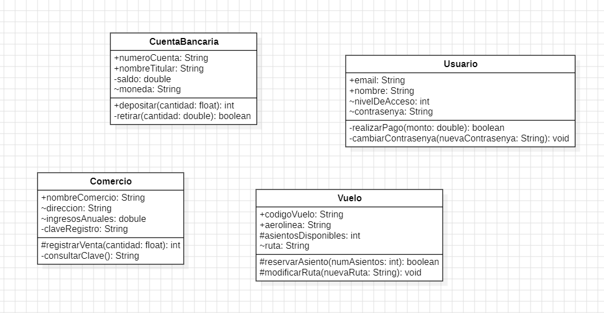

# Tare Modelo de Clases 
##  Repositorios 
Aquí tienes otros repositorios:
- [ProyectoL](https://github.com/Proyecto1k2024Grupo6/Proyecto) 
- [Base de Datos](https://github.com/Proyecto1k2024Grupo6/Base-de-datos) 
- [Modelo de clases en Java](https://github.com/Proyecto1k2024Grupo6/Modelo-de-Clases-en-JAVA) 
- [XML y Jason a Java](https://github.com/Proyecto1k2024Grupo6/XML-y-Jason-a-Java)

>
